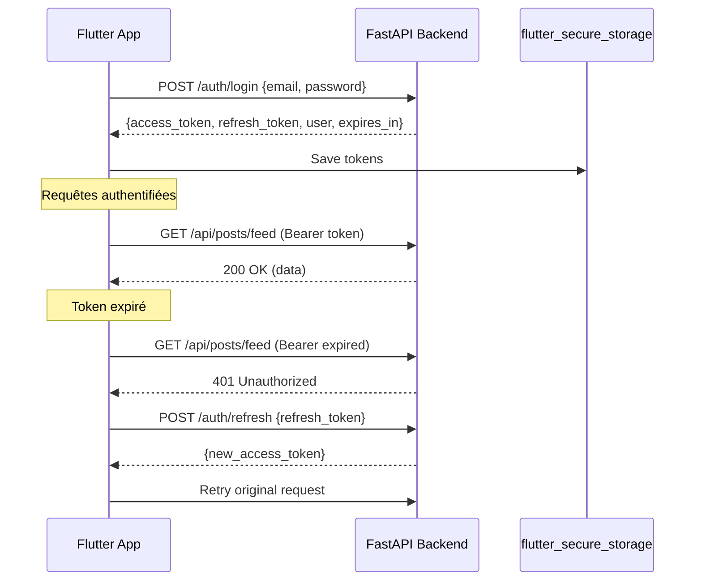

# 📊 Analyse Comparative KMP → Flutter — BuyV

**Date :** 19 Mars 2026
**Projet :** BuyV — E-commerce social (Instagram/TikTok-style)
**Objectif :** Migration Kotlin Multiplatform → Flutter (single codebase)

## Decisions Validees (19 Mars 2026)

- State Management : **Riverpod** (valide)
- Offline Storage : **Hive** (valide)
- Scope migration : **100% des features** (CJ Import, Admin, Promoter, Camera, Sounds)
- Cles/config : disponibles via **.env**
- Approche execution : **pragmatique** (priorite au fonctionnel)

---

## 1. État des Lieux Technique — Architecture Actuelle (KMP)

### 1.1 Cartographie des Modules/Packages

```
buyv_kotlin/
├── shared/src/commonMain/kotlin/          # 56 fichiers KMP partagés
│   ├── data/
│   │   ├── local/                         # TokenManager, CartStorage, CurrentUserProvider
│   │   ├── remote/
│   │   │   ├── api/                       # 11 API Services (Ktor)
│   │   │   ├── dto/                       # BackendDtos.kt (612 lignes, 40+ DTOs)
│   │   │   └── mapper/                    # DtoMappers.kt
│   │   ├── repository/                    # 12 Network Repositories
│   │   └── util/                          # HtmlSanitizer
│   ├── domain/
│   │   ├── model/                         # AuthState, BlockedUser, AppLocale, etc.
│   │   ├── repository/                    # Repository interfaces
│   │   ├── usecase/                       # 60+ Use Cases (auth, cart, order, post, etc.)
│   │   └── platform/                      # AudioExtractor, CameraController (expect/actual)
│   └── di/                                # Koin: SharedModule, KoinHelper, PlatformModule
│
├── e-commerceAndroidApp/src/main/         # 48 écrans, 46 ViewModels
│   ├── presentation/ui/screens/           # Jetpack Compose UI
│   ├── presentation/viewModel/            # MVVM ViewModels
│   ├── data/                              # Admin API (Retrofit), Cloudinary, Interceptors
│   ├── domain/                            # Android-specific models & repos
│   └── di/                                # AppModule, CameraModule, MarketplaceModule
│
├── e-commerceiosApp/                      # 28 écrans SwiftUI
│   └── Views/, ViewModels/, Theme/
│
├── buyv_backend/app/                      # 29 modules Python FastAPI
│   ├── auth.py, users.py, posts.py        # Core API
│   ├── marketplace/                       # CJ Dropshipping integration
│   └── sounds.py, tracking.py, etc.
│
└── buyv_admin/                            # Flask admin panel (web)
```

### 1.2 Patterns Architecturaux

| Pattern | Implémentation KMP | Détails |
|---------|-------------------|---------|
| **Architecture** | Clean Architecture (3 couches) | `data/` → `domain/` → `presentation/` |
| **UI Pattern** | MVVM | ViewModels avec StateFlow/MutableStateFlow |
| **DI** | Koin 3.5.3 | [SharedModule.kt](file:///c:/Users/user/Desktop/Buyv/buyv_kotlin/shared/src/commonMain/kotlin/com/project/e_commerce/di/SharedModule.kt) (354 lignes), 4 modules: network, repository, useCase, platform |
| **Networking** | Ktor 2.3.x | Client authenticated + public, intercepteur JWT auto-refresh |
| **Serialization** | kotlinx.serialization | DTOs avec `@SerialName` pour snake_case mapping |
| **Navigation** | Jetpack Navigation Compose | [Screens.kt](file:///c:/Users/user/Desktop/Buyv/buyv_kotlin/e-commerceAndroidApp/src/main/java/com/project/e_commerce/android/presentation/ui/navigation/Screens.kt) sealed class, 46 routes |
| **Media** | ExoPlayer (Media3 1.2.1) | Lecture vidéo TikTok-style |
| **Images** | Coil 3.3.0 | Chargement asynchrone d'images |
| **Uploads** | Cloudinary 3.1.1 | Photos/vidéos vers CDN |
| **Paiements** | Stripe Android SDK 21.4.0 | Intégration paiement natif |
| **Animations** | Lottie Compose 6.6.7 | Animations vectorielles |
| **Caméra** | CameraX 1.3.4 + GPUImage | Capture vidéo avec filtres |

### 1.3 Gestion d'État Actuelle

- **Reels Feed** : `MutableStateFlow<List<Reels>>` dans [ReelsScreenViewModel](file:///c:/Users/user/Desktop/Buyv/buyv_kotlin/e-commerceAndroidApp/src/main/java/com/project/e_commerce/android/presentation/viewModel/reelsScreenViewModel/ReelsScreenViewModel.kt#43-850) (852 lignes)
- **Profile** : `MutableStateFlow<ProfileUIState>` avec multiples sub-states
- **Auth** : `CurrentUserProvider` + `TokenManager` (EncryptedSharedPreferences)
- **Cart** : Local-first avec `CartStorage` (offline)
- **Pattern** : Optimistic UI updates + rollback on error (likes, bookmarks)

### 1.4 Injection de Dépendances (Koin)

Modules définis dans [SharedModule.kt](file:///c:/Users/user/Desktop/Buyv/buyv_kotlin/shared/src/commonMain/kotlin/com/project/e_commerce/di/SharedModule.kt) :
- **networkModule** : HttpClient (authenticated/public), 11 API Services
- **repositoryModule** : 12 Repository implémentations
- **useCaseModule** : 60+ Use Cases
- **platformModule** : Platform-specific (TokenManager, CartStorage)

### 1.5 Librairies Tierces Critiques

| Librairie KMP | Usage | Criticité |
|---------------|-------|-----------|
| Ktor 2.3.7 | HTTP Client + Auth + Content Negotiation | 🔴 Critique |
| Koin 3.5.3 | Dependency Injection | 🔴 Critique |
| kotlinx.serialization | JSON parsing (40+ DTOs) | 🔴 Critique |
| Media3/ExoPlayer 1.2.1 | Video player (Reels) | 🔴 Critique |
| Coil 3.3.0 | Image loading | 🟡 Moyen |
| Cloudinary 3.1.1 | Media upload CDN | 🔴 Critique |
| Stripe 21.4.0 | Payment processing | 🔴 Critique |
| Lottie 6.6.7 | Animations (heart, etc.) | 🟢 Simple |
| CameraX 1.3.4 | In-app camera | 🟡 Moyen |
| GPUImage 2.1.0 | Video filters | 🟡 Moyen |
| Firebase Auth 23.2.1 | Google/Facebook Sign-In | 🟡 Moyen (transitional) |
| OkHttp 5.1.0 | Network + cert pinning | 🟡 Moyen |

---

## 2. Équivalents Flutter

| Composant KMP | Équivalent Flutter | Complexité | Notes |
|---------------|-------------------|------------|-------|
| **Ktor Client** | `dio` 5.x | 🟡 Moyen | Interceptors pour JWT auth, refresh token mutex logic → `dio` Interceptor |
| **Koin DI** | `get_it` + `injectable` | 🟢 Simple | Mapping direct, même pattern service locator |
| **kotlinx.serialization DTOs** | `json_serializable` + `freezed` | 🟡 Moyen | 40+ DTOs à convertir, `@JsonKey` pour snake_case |
| **Jetpack Compose UI** | Flutter Widgets | 🟡 Moyen | Paradigme similaire (déclaratif), syntax différente |
| **StateFlow/MVVM** | `Riverpod` | 🟡 Moyen | **Decision validee : Riverpod 2.x** (le plus proche de StateFlow) |
| **Navigation Compose** | `go_router` | 🟡 Moyen | 46 routes à migrer, deep linking intégré |
| **ExoPlayer (Media3)** | `video_player` + `chewie` ou `better_player` | 🔴 Complexe | Feed vertical TikTok = logique pagination + preloading |
| **Coil (images)** | `cached_network_image` | 🟢 Simple | Drop-in replacement |
| **Cloudinary upload** | `cloudinary_sdk` / `dio` multipart | 🟡 Moyen | Upload vidéo/photo vers Cloudinary API |
| **Stripe SDK** | `flutter_stripe` | 🟡 Moyen | SDK officiel Flutter disponible |
| **Lottie** | `lottie` (pub.dev) | 🟢 Simple | Même fichiers JSON Lottie |
| **CameraX** | `camera` (pub.dev) | 🟡 Moyen | Package officiel, filtres via `flutter_gpu_image` |
| **EncryptedSharedPrefs** | `flutter_secure_storage` | 🟢 Simple | AES encryption, même API |
| **Material3** | `material.dart` (Flutter 3.x) | 🟢 Simple | Support natif Material 3 |
| **Retrofit (Admin)** | `dio` | 🟢 Simple | Déjà couvert par dio |
| **EmojiCompat** | Natif Flutter | 🟢 Simple | Flutter gère les emojis nativement |
| **Paging3** | `infinite_scroll_pagination` | 🟡 Moyen | Pagination produits marketplace |
| **Firebase Auth** | `firebase_auth` (FlutterFire) | 🟢 Simple | SDK officiel bien maintenu |
| **Facebook Login** | `flutter_facebook_auth` | 🟢 Simple | Package maintenu |
| **Google Sign-In** | `google_sign_in` | 🟢 Simple | Package officiel Google |

---

## 3. Points de Compatibilité Backend

### 3.1 Backend : Python FastAPI (inchangé)

| Aspect | Détails |
|--------|---------|
| **Framework** | FastAPI (Python) |
| **Base URL** | `ApiEnvironment.baseUrl` (configurable DEV/STAGING/PROD) |
| **Auth** | JWT Bearer tokens (access + refresh) |
| **Format** | JSON, snake_case backend ↔ camelCase mobile (via `@SerialName`) |
| **Rate Limiting** | 200 req/min (SlowAPI) |
| **Hosting** | Railway (production) |

### 3.2 API Endpoints (29 modules)

| Module Backend | Routes Principales | Flutter Impact |
|--------------|-------------------|---------------|
| [auth.py](file:///c:/Users/user/Desktop/Buyv/buyv_kotlin/buyv_backend/app/auth.py) | `/auth/login`, `/auth/register`, `/auth/google-signin`, `/auth/facebook-signin` | `dio` POST, `flutter_secure_storage` pour tokens |
| [users.py](file:///c:/Users/user/Desktop/Buyv/buyv_kotlin/buyv_backend/app/users.py) | `/api/users/{id}`, `/api/users/search`, `/api/users/me/delete` | Profils, recherche, suppression compte |
| [follows.py](file:///c:/Users/user/Desktop/Buyv/buyv_kotlin/buyv_backend/app/follows.py) | `/api/follows/follow`, `/api/follows/unfollow`, `/api/follows/followers/{id}` | Système social follow/unfollow |
| [posts.py](file:///c:/Users/user/Desktop/Buyv/buyv_kotlin/buyv_backend/app/posts.py) | `/api/posts/feed`, `/api/posts/{id}`, `/api/posts/create` | Feed reels, CRUD posts |
| [comments.py](file:///c:/Users/user/Desktop/Buyv/buyv_kotlin/buyv_backend/app/comments.py) | `/api/comments/{postId}`, `/api/comments/add` | Commentaires, likes de commentaires |
| [orders.py](file:///c:/Users/user/Desktop/Buyv/buyv_kotlin/buyv_backend/app/orders.py) | `/api/orders/create`, `/api/orders/user`, `/api/orders/{id}/cancel` | Checkout, historique commandes |
| [payments.py](file:///c:/Users/user/Desktop/Buyv/buyv_kotlin/buyv_backend/app/payments.py) | `/api/payments/create-intent`, `/api/payments/confirm` | Intégration Stripe |
| `marketplace/` | `/api/marketplace/products`, `/api/marketplace/promotions` | Catalogue CJ, promotions |
| [sounds.py](file:///c:/Users/user/Desktop/Buyv/buyv_kotlin/buyv_backend/app/sounds.py) | `/api/sounds/{id}`, `/api/sounds/trending` | Musiques réutilisables |
| [tracking.py](file:///c:/Users/user/Desktop/Buyv/buyv_kotlin/buyv_backend/app/tracking.py) | `/api/tracking/view`, `/api/tracking/click` | Analytics affiliés |
| [admin_dashboard.py](file:///c:/Users/user/Desktop/Buyv/buyv_kotlin/buyv_backend/app/admin_dashboard.py) | `/api/admin/dashboard/stats`, `/api/admin/users` | Panel admin in-app |
| [withdrawal.py](file:///c:/Users/user/Desktop/Buyv/buyv_kotlin/buyv_backend/app/withdrawal.py) | `/api/withdrawals/request` | Retraits wallet promoters |
| [blocked_users.py](file:///c:/Users/user/Desktop/Buyv/buyv_kotlin/buyv_backend/app/blocked_users.py) | `/api/blocked-users/` | Blocage utilisateurs |
| [reports.py](file:///c:/Users/user/Desktop/Buyv/buyv_kotlin/buyv_backend/app/reports.py) | `/api/reports/` | Signalements contenu |

### 3.3 Authentication Flow



### 3.4 Schémas de Données Principaux (DTOs)

> 40+ DTOs dans [BackendDtos.kt](file:///c:/Users/user/Desktop/Buyv/buyv_kotlin/shared/src/commonMain/kotlin/com/project/e_commerce/data/remote/dto/BackendDtos.kt), tous mappés 1:1 avec les schémas Pydantic du backend.

| DTO | Champs Clés | Utilisé Par |
|-----|-------------|-------------|
| [AuthResponseDto](file:///c:/Users/user/Desktop/Buyv/buyv_kotlin/shared/src/commonMain/kotlin/com/project/e_commerce/data/remote/dto/BackendDtos.kt#16-24) | access_token, refresh_token, user, expires_in | Login, Register |
| [UserDto](file:///c:/Users/user/Desktop/Buyv/buyv_kotlin/shared/src/commonMain/kotlin/com/project/e_commerce/data/remote/dto/BackendDtos.kt#28-46) | id, email, username, displayName, profileImageUrl, role, followers/followingCount | Profils |
| [PostDto](file:///c:/Users/user/Desktop/Buyv/buyv_kotlin/shared/src/commonMain/kotlin/com/project/e_commerce/data/remote/dto/BackendDtos.kt#105-132) | id, userId, type, videoUrl, thumbnailUrl, caption, likesCount, isLiked, isBookmarked | Feed Reels |
| [OrderDto](file:///c:/Users/user/Desktop/Buyv/buyv_kotlin/shared/src/commonMain/kotlin/com/project/e_commerce/data/remote/dto/BackendDtos.kt#185-201) | id, orderNumber, items[], status, total, shippingAddress | Commandes |
| [OrderCreateRequest](file:///c:/Users/user/Desktop/Buyv/buyv_kotlin/shared/src/commonMain/kotlin/com/project/e_commerce/data/remote/dto/BackendDtos.kt#138-153) | items[], subtotal, shipping, tax, total, payment_method | Création commande |
| [CommentDto](file:///c:/Users/user/Desktop/Buyv/buyv_kotlin/shared/src/commonMain/kotlin/com/project/e_commerce/data/remote/dto/BackendDtos.kt#322-336) | id, userId, content, likesCount, isLiked | Commentaires |
| [SoundDto](file:///c:/Users/user/Desktop/Buyv/buyv_kotlin/shared/src/commonMain/kotlin/com/project/e_commerce/data/remote/dto/BackendDtos.kt#508-522) | id, uid, title, artist, audioUrl, genre, usageCount | Musiques |
| [AdminDashboardStatsDto](file:///c:/Users/user/Desktop/Buyv/buyv_kotlin/shared/src/commonMain/kotlin/com/project/e_commerce/data/remote/dto/BackendDtos.kt#350-370) | total_users, total_posts, total_orders, total_revenue | Dashboard admin |

---

## 4. Stack Flutter Recommandée

| Catégorie | Package | Version | Justification |
|-----------|---------|---------|---------------|
| **State Management** | `riverpod` | 2.x | Le plus proche de StateFlow/MVVM Kotlin |
| **HTTP Client** | `dio` | 5.x | Interceptors, timeout, multipart upload |
| **Router** | `go_router` | 14.x | Type-safe, deep linking, redirects |
| **DI** | `get_it` + `injectable` | 7.x / 2.x | Même pattern que Koin (service locator) |
| **JSON** | `json_serializable` + `freezed` | 6.x / 2.x | Code gen, immutable models |
| **Secure Storage** | `flutter_secure_storage` | 9.x | Remplacement EncryptedSharedPreferences |
| **Video Player** | `video_player` + custom | 2.x | Feed vertical TikTok-style |
| **Image Cache** | `cached_network_image` | 3.x | Drop-in pour Coil |
| **Media Upload** | `dio` multipart | - | Upload Cloudinary via REST API |
| **Payments** | `flutter_stripe` | 11.x | SDK officiel Stripe |
| **Animations** | `lottie` | 3.x | Mêmes fichiers .json |
| **Camera** | `camera` | 0.11.x | Capture vidéo |
| **Firebase Auth** | `firebase_auth` | 5.x | Google, Facebook, Apple Sign-In |
| **Local Cache** | `hive` + `hive_flutter` | 4.x / 1.x | **Decision validee** pour offline-first (cart, preferences) |
| **Infinite Scroll** | `infinite_scroll_pagination` | 4.x | Remplacement Paging3 |

---

## 5. Métriques de Complexité

| Module | Fichiers KMP | Écrans Android | Complexité Migration | Estimation |
|--------|-------------|----------------|---------------------|------------|
| Auth & Onboarding | 8 use cases, 3 API | 5 écrans | 🟡 Moyen | 5 jours |
| Reels Feed | 1 ViewModel (852L), Post API | 3 écrans | 🔴 Complexe | 10 jours |
| Products & Search | 3 use cases, Product API | 5 écrans | 🟡 Moyen | 5 jours |
| Cart & Checkout | 6 use cases, local storage | 3 écrans | 🟡 Moyen | 4 jours |
| Orders | 5 use cases, Order API | 3 écrans | 🟡 Moyen | 3 jours |
| Profile & Social | 10 use cases, User API | 6 écrans | 🟡 Moyen | 6 jours |
| Comments | 4 use cases, Comments API | 1 BottomSheet | 🟢 Simple | 2 jours |
| Sound/Music | 5 use cases, Sound API | 2 écrans | 🟡 Moyen | 3 jours |
| Marketplace/Promoter | 4 use cases, Marketplace API | 5 écrans | 🟡 Moyen | 5 jours |
| Admin Panel | 14 écrans (Retrofit) | 14 écrans | 🔴 Complexe | 8 jours |
| Payments (Stripe) | Payment API | 2 écrans | 🟡 Moyen | 3 jours |
| Camera & Upload | CameraX, Cloudinary | 2 écrans | 🔴 Complexe | 5 jours |
| **TOTAL** | **56 shared + 56 Android** | **48+ écrans** | - | **~59 jours** |
