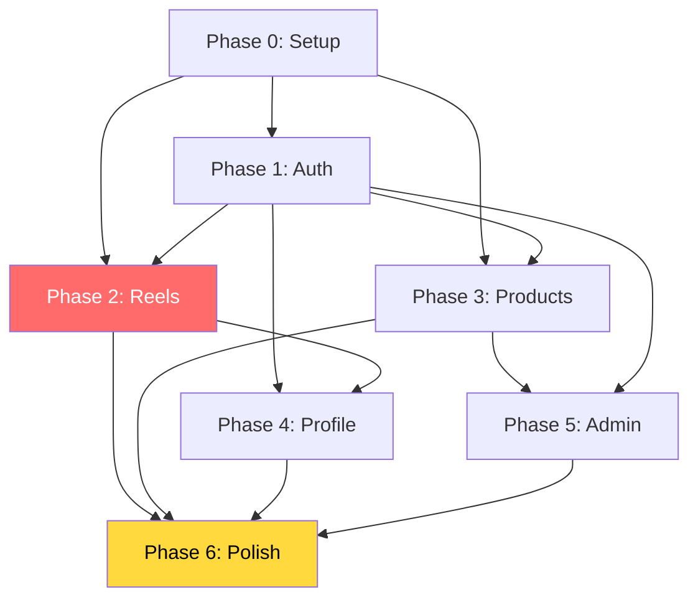

# 🚀 Plan de Migration KMP → Flutter — BuyV

**Légende :** ✅ Fait | 🟡 En cours | ⚪ Pas encore fait | ⚠️ Bloqué | 🔴 Critique

## Journal de Traçabilité

| Date | Type | Decision / Avancement | Impact Plan |
|------|------|-----------------------|-------------|
| 19/03/2026 | Decision | State management valide : Riverpod | Conserve Riverpod sur toutes les phases (notamment Phase 2) |
| 19/03/2026 | Decision | Offline storage valide : Hive | Verrouille le choix Hive pour cart/cache local (Phase 3) |
| 19/03/2026 | Decision | Scope valide : migration complete (CJ Import, Admin, Promoter, Camera, Sounds) | Aucun de-scope autorise, Phase 5 et 6 restent completes |
| 19/03/2026 | Decision | Cles/config disponibles dans `.env` | Le setup secrets n'est plus un bloqueur de phase |
| 19/03/2026 | Cadence | Approche pragmatique (pas de perfectionnisme) | Priorite au flux end-to-end fonctionnel puis ameliorations |
| 19/03/2026 | Execution | Version non finale : scope fonctionnel complet d'abord | Les defis techniques restants sont traces puis traites en fin d'implementation |
| 19/03/2026 | Avancement | Socle Reels Flutter implemente (feed provider + datasource + ecran vertical) | Phase 2 passe de non demarree a en cours |
| 19/03/2026 | Avancement | Data sources Comments + Sounds ajoutes | Preparation directe des prochains ecrans/flows Phase 2 |
| 19/03/2026 | Avancement | Comments BottomSheet branche sur Reels (auth guard + ajout commentaire + sync compteur) | Phase 2.4/2.5 passe en avancement fonctionnel |
| 19/03/2026 | Avancement | Suppression commentaire (owner) + delta net compteur commentaires implemente | Cohérence feed <-> bottom sheet renforcee en Phase 2 |
| 19/03/2026 | Avancement | Social overlay reels etendu (share + cart) avec navigation et auth guard cart | Couverture fonctionnelle Phase 2.3 renforcee |
| 19/03/2026 | Avancement | Onglets Commentaires/Ratings ajoutes dans BottomSheet (COM-001 en mode progressif) | COM-001 passe de non demarre a en cours |
| 19/03/2026 | Avancement | Ratings relies a l'API produit marketplace (average_rating + rating_count) | COM-001 passe en integration backend partielle |
| 19/03/2026 | Avancement | Product card overlay compacte ajoutee dans Reels (CTA vers produit lie) | Avancement concret sur la tache Product card overlay Phase 2.3 |
| 19/03/2026 | Avancement | Video preloading next 2 implemente avec cache de controllers | Fluidite swipe Reels amelioree et tache Phase 2.3 debloquee |
| 19/03/2026 | Avancement | Product card overlay enrichie via API (image + nom + prix) | Product overlay devient exploitable en usage reel |
| 19/03/2026 | Avancement | Owner mode Reels active (menu actions + suppression post) | Tache owner overlay Phase 2.3 passe en implementation fonctionnelle |
| 19/03/2026 | Avancement | Long press context menu active sur Reels (UI-005) | Actions rapides unifiees (share/comment/product/owner-report) |
| 19/03/2026 | Avancement | Action report branchee au backend (`POST /api/reports`) avec choix de raison | UI-005 passe en integration backend |
| 19/03/2026 | Avancement | Signalement enrichi avec description optionnelle | Qualite moderation amelioree sans bloquer le parcours |
| 19/03/2026 | Avancement | Edition caption owner active (backend `PATCH /posts/{post_uid}` + UI Flutter) | Owner mode couvre desormais edit + delete |
| 19/03/2026 | Avancement | Templates rapides ajoutes pour la description de signalement | Qualite et rapidite des reports ameliorees |
| 19/03/2026 | Avancement | Limites de longueur + compteurs live ajoutes (caption edit / report description) | Qualite saisie et robustesse UX renforcees |
| 19/03/2026 | QA | Script smoke Task 2.6 ajoute (`test_task_2.6_owner_edit_report.ps1`) | Verification rapide backend edit caption + report facilitee |
| 19/03/2026 | QA | Script Task 2.6 execute avec succes (PATCH caption + GET verify + POST report) | Validation E2E confirmee en local sur `localhost:8000` |
| 19/03/2026 | Avancement | Onglet Ratings enrichi avec distribution etoiles estimee (5->1) dans le BottomSheet Reels | Visibilite detail ratings amelioree en attendant un endpoint backend de breakdown |

---

## Regle d'Execution (Version Non Finale)

- Implementer en integralite toutes les fonctionnalites deja definies dans le scope.
- Eviter le perfectionnisme technique qui retarde la couverture fonctionnelle.
- Noter et tracer les defis techniques non bloquants dans un registre dedie.
- Traiter ces defis en fin d'implementation fonctionnelle (avant stabilisation finale).

## Registre des Defis Techniques Reportes

| ID | Sujet | Impact | Workaround | Cible de resolution |
|----|-------|--------|------------|---------------------|
| DT-001 | Following feed serveur vs client | Scalabilite/perf feed | Fallback filtrage client temporaire | Fin Phase 2 |
| DT-002 | Cart parity vs redesign | Risque regression checkout | Reproduire comportement KMP via Hive d'abord | Fin Phase 3 |
| DT-003 | Strategie iOS progressive | Risque de surprise platforme | Smoke tests iOS hebdo durant dev | Fin Phase 6 |
| DT-004 | Benchmarks perf definitifs | Critere d'acceptation flou | Seuils provisoires puis calibration | Fin Phase 6 |

---

## Phase 0 : Setup & Architecture Flutter (5 jours)

### 0.1 — Initialisation Projet
| Tâche | Status | Complexité | Détails |
|-------|--------|-----------|---------|
| Initialiser Flutter project dans `buyv_flutter/` | ✅ | 🟢 | `flutter create --org com.project --project-name buyv .` |
| Configurer `pubspec.yaml` avec stack recommandée | ✅ | 🟢 | dio, riverpod, go_router, freezed, get_it, etc. |
| Créer structure de dossiers Clean Arch | ✅ | 🟢 | `lib/{core,data,domain,presentation}/` |
| Configurer `analysis_options.yaml` (lint strict) | ✅ | 🟢 | `flutter_lints`, rules custom |
| Configurer flavors (dev/staging/prod) | ✅ | 🟡 | `.env` files, base URLs dynamiques |

### 0.2 — Design System
| Tâche | Status | Complexité | Détails |
|-------|--------|-----------|---------|
| Créer `app_theme.dart` | ✅ | 🟢 | Primary: #F4A032, Secondary: #0B649B, Text: #114B7F |
| Configurer Material 3 theme | ✅ | 🟢 | `ColorScheme.fromSeed()`, Typography, shapes |
| Créer composants réutilisables (BuyVButton, BuyVCard, etc.) | ✅ | 🟡 | 10-15 widgets de base |
| Intégrer Google Fonts (Inter ou Roboto) | ✅ | 🟢 | `google_fonts` package |

### 0.3 — Core Infrastructure
| Tâche | Status | Complexité | Détails |
|-------|--------|-----------|---------|
| `ApiClient` (dio) avec interceptors JWT | ✅ | 🟡 | Token refresh mutex (reproduire `KtorClientConfig.kt`) |
| `ApiEnvironment` (configurable base URL) | ✅ | 🟢 | DEV: `http://192.168.11.109:8000`, PROD: Railway URL |
| Centralisation des secrets via `.env` (Firebase/Stripe/Cloudinary) | ✅ | 🟢 | Plus de blocage acces cles pour les phases suivantes |
| `SecureStorage` service (tokens) | ✅ | 🟢 | `flutter_secure_storage` |
| `get_it` setup + modules DI | ✅ | 🟡 | Mapper les 4 modules Koin → get_it |
| `go_router` configuration (46 routes) | ✅ | 🟡 | Migrer `Screens.kt` sealed class → GoRouter routes |
| Error handling global | ✅ | 🟢 | `AppException`, error boundary widget |
| `HtmlSanitizer` utility | ✅ | 🟢 | Fix bug HTML brut (UPLOAD-002) |

### 0.4 — Decisions Architecture Verrouillees
| Tâche | Status | Complexité | Détails |
|-------|--------|-----------|---------|
| State management : Riverpod | ✅ | 🟢 | Valide comme standard projet |
| Offline storage : Hive | ✅ | 🟢 | Valide pour cart/cache offline-first |
| Scope migration : 100% des features | ✅ | 🟢 | CJ Import + Admin + Promoter + Camera + Sounds inclus |
| Approche livraison pragmatique | ✅ | 🟢 | Livraison iterative, focus valeur produit |

---

## Phase 1 : Auth & Sécurité (5 jours)

### 1.1 — Modèles de Données Auth
| Tâche | Status | Fichier KMP Source | Fichier Flutter Cible | Complexité |
|-------|--------|-------------------|----------------------|-----------|
| `AuthResponse` model | ✅ | `BackendDtos.kt:17-23` | `lib/data/models/auth_response.dart` | 🟢 |
| `User` model | ✅ | `BackendDtos.kt:29-45` | `lib/domain/models/user.dart` | 🟢 |
| `LoginRequest` model | ✅ | `BackendDtos.kt:51-54` | `lib/data/models/auth_request.dart` | 🟢 |
| `UserCreate` model | ✅ | `BackendDtos.kt:84-89` | `lib/data/models/auth_request.dart` | 🟢 |

### 1.2 — API & Repository Auth
| Tâche | Status | Fichier KMP Source | Fichier Flutter Cible | Complexité |
|-------|--------|-------------------|----------------------|-----------|
| `AuthApiService` → `AuthRemoteDataSource` | ✅ | `AuthApiService.kt` | `lib/data/datasources/auth_remote.dart` | 🟡 |
| `AuthRepository` interface | ✅ | `domain/repository/AuthRepository` | `lib/domain/repositories/auth_repository.dart` | 🟢 |
| `AuthRepositoryImpl` | ✅ | `AuthNetworkRepository.kt` | `lib/data/repositories/auth_repository_impl.dart` | 🟡 |
| `TokenManager` service | ✅ | `TokenManager.kt` | `lib/core/services/token_manager.dart` | 🟡 |
| `CurrentUserProvider` | ✅ | `CurrentUserProvider.kt` | `lib/core/services/current_user_provider.dart` | 🟡 |

### 1.3 — Use Cases Auth
| Tâche | Status | Use Case KMP | Complexité |
|-------|--------|-------------|-----------|
| `LoginUseCase` | ✅ | `auth/LoginUseCase` | 🟢 |
| `RegisterUseCase` | ✅ | `auth/RegisterUseCase` | 🟢 |
| `LogoutUseCase` | ✅ | `auth/LogoutUseCase` | 🟢 |
| `GetCurrentUserUseCase` | ✅ | `auth/GetCurrentUserUseCase` | 🟢 |
| `SendPasswordResetUseCase` | ✅ | `auth/SendPasswordResetUseCase` | 🟢 |
| `ConfirmPasswordResetUseCase` | ✅ | `auth/ConfirmPasswordResetUseCase` | 🟢 |
| `GoogleSignInUseCase` | ✅ | `auth/GoogleSignInUseCase` | 🟡 |
| `FacebookSignInUseCase` | ✅ | `auth/FacebookSignInUseCase` | 🟡 |

### 1.4 — Écrans Auth
| Tâche | Status | Écran KMP | Complexité | Bug Fix Inclus |
|-------|--------|----------|-----------|---------------|
| `LoginScreen` | ✅ | `LoginScreen.kt` | 🟡 | AUTH-001 (SHA-1) |
| `CreateAccountScreen` | ✅ | `CreateAnAccountScreen.kt` | 🟡 | — |
| `ForgetPasswordScreen` | ✅ | `ForgetPasswordScreen.kt` | 🟢 | — |
| `ResetPasswordScreen` | ✅ | `ResetPasswordScreen.kt` | 🟢 | — |
| `PasswordChangedSuccessScreen` | ✅ | `PasswordChangedSuccessScreen.kt` | 🟢 | — |
| **Guest Mode** (NOUVEAU) | ✅ | N/A | 🟡 | AUTH-003, AUTH-004 |
| **LoginBottomSheet** (NOUVEAU) | ✅ | N/A | 🟡 | AUTH-004 |

---

## Phase 2 : Feed Reels & Video Player (10 jours) 🔴 Critique

### 2.1 — Modèles de Données Posts
| Tâche | Status | DTO KMP | Complexité |
|-------|--------|--------|-----------|
| `Post` model (freezed) | ⚪ | `PostDto` (BackendDtos.kt:106-131) | 🟢 |
| `PostCreateRequest` | ⚪ | `PostCreateRequest` | 🟢 |
| `Comment` model | ⚪ | `CommentDto` (BackendDtos.kt:323-335) | 🟢 |
| `Sound` model | ⚪ | `SoundDto` (BackendDtos.kt:509-521) | 🟢 |

### 2.2 — API & Repository Posts
| Tâche | Status | Fichier Source | Complexité |
|-------|--------|---------------|-----------|
| `PostRemoteDataSource` | ✅ | `PostApiService.kt` | 🟡 |
| `PostRepository` interface + impl | ⚪ | `PostNetworkRepository.kt` | 🟡 |
| `CommentRemoteDataSource` | ✅ | `CommentsApiService.kt` | 🟡 |
| `CommentRepository` | ⚪ | `CommentNetworkRepository.kt` | 🟡 |
| `SoundRemoteDataSource` | ✅ | `SoundApiService.kt` | 🟢 |

### 2.3 — TikTok-Style Video Feed 🔴
| Tâche | Status | Complexité | Bug Fix Inclus |
|-------|--------|-----------|---------------|
| `ReelsFeedScreen` avec `PageView` vertical | 🟡 | 🔴 | Base fonctionnelle livree |
| `VideoPlayerWidget` (play/pause/buffer) | 🟡 | 🔴 | Base play/pause active, polish restant |
| Video preloading logic (next 2 videos) | 🟡 | 🔴 | Cache de prechargement actif, tuning memoire restant |
| Social overlay (like, comment, share, cart) | 🟡 | 🟡 | Actions share/cart activees (polish restant) |
| Product card overlay (compact) | 🟡 | 🟡 | CTA + image/nom/prix actives, polish UI restant |
| Double-tap like animation | ⚪ | 🟡 | VIDEO-006 (Lottie heart) |
| Owner mode (Edit/Delete overlay) | 🟡 | 🟡 | Edit + delete actifs (polish UX restant) |
| Back press BottomSheet handling | ⚪ | 🟢 | VIDEO-004 (natif Flutter) |
| Long press context menu | 🟡 | 🟢 | UI-005 implemente avec report backend + templates rapides |
| Tab system (For You / Following / Explore) | ⚪ | 🟡 | — |

### 2.4 — State Management Reels
| Tâche | Status | Source KMP | Complexité |
|-------|--------|-----------|-----------|
| `ReelsFeedNotifier` (Riverpod) | 🟡 | `ReelsScreenViewModel.kt` (852L) | 🔴 |
| Optimistic like/unlike + rollback | 🟡 | Lignes 479-551 | 🟡 |
| Comment add/refresh logic | 🟡 | Lignes 583-709 | 🟡 |
| `PostEventBus` (stream) | 🟡 | `PostEventBus.kt` | 🟡 |
| Guest mode auth guard | 🟡 | N/A | 🟡 |

### 2.5 — Comments BottomSheet
| Tâche | Status | Complexité | Bug Fix |
|-------|--------|-----------|---------|
| Comments list avec avatars | 🟡 | 🟡 | — |
| Add comment form | 🟡 | 🟢 | — |
| Like comment toggle | 🟡 | 🟢 | — |
| Delete own comment | 🟡 | 🟢 | — |
| Ratings tab (COM-001) | 🟡 | 🟡 | API moyenne/volume branchee, distribution/detail des avis restant |

---

## Phase 3 : Products, Cart & Checkout (12 jours)

### 3.1 — Products
| Tâche | Status | Source | Complexité | Bug Fix |
|-------|--------|--------|-----------|---------|
| `Product` model | ⚪ | Marketplace models | 🟢 | — |
| `ProductRemoteDataSource` | ⚪ | `MarketplaceApiService.kt` | 🟡 | — |
| `ProductListScreen` (catégories, recherche) | ⚪ | `ProductScreen.kt` | 🟡 | CAT-001, CAT-005 |
| `ProductDetailScreen` | ⚪ | `DetailsScreen.kt` | 🟡 | PROD-002 (URL), PROD-003 (image) |
| `SearchScreen` | ⚪ | `SearchScreen.kt` | 🟡 | — |
| Category chips + filtering | ⚪ | N/A | 🟡 | CAT-001 |
| Dynamic promo banners | ⚪ | N/A | 🟢 | PROD-005 |
| Infinite scroll pagination | ⚪ | `MarketplaceProductPagingSource.kt` | 🟡 | — |

### 3.2 — Cart (Offline-First)
| Tâche | Status | Source | Complexité |
|-------|--------|--------|-----------|
| `Cart` model + `CartItem` | ⚪ | `CartStorage.kt` | 🟢 |
| `CartRepository` (Hive local) | ⚪ | `CartRepositoryImpl.kt` | 🟡 |
| `CartScreen` UI | ⚪ | `CartScreen.kt` | 🟡 |
| Cart use cases (add, remove, update, clear) | ⚪ | 6 use cases | 🟢 |

### 3.3 — Orders & Checkout
| Tâche | Status | Source | Complexité |
|-------|--------|--------|-----------|
| `Order` model (freezed) | ⚪ | `OrderDto` (BackendDtos.kt) | 🟢 |
| `OrderRemoteDataSource` | ⚪ | `OrderApiService.kt` | 🟡 |
| `OrderRepository` | ⚪ | `OrderNetworkRepository.kt` | 🟡 |
| `PaymentScreen` (Stripe) | ⚪ | `StripePaymentScreen.kt` | 🔴 |
| `OrdersHistoryScreen` | ⚪ | `OrdersHistoryScreen.kt` | 🟡 |
| `TrackOrderScreen` | ⚪ | `TrackOrderScreen.kt` | 🟡 |

---

## Phase 4 : Profile, Social & Settings (6 jours)

### 4.1 — Profile
| Tâche | Status | Source | Bug Fix |
|-------|--------|--------|---------|
| `ProfileScreen` (stats, grid, tabs) | ⚪ | `ProfileViewModel.kt` (365L) | Ghost reels (#12) |
| `EditProfileScreen` | ⚪ | `EditProfileScreen.kt` | — |
| Profile grid 9:16 aspect ratio | ⚪ | — | UI-004 |
| Post deletion + sync | ⚪ | `deletePost()` | Ghost reels (#12) |

### 4.2 — Social
| Tâche | Status | Source | Complexité |
|-------|--------|--------|-----------|
| `UserProfileScreen` (other user) | ⚪ | `UserProfileScreen.kt` | 🟡 |
| Follow/Unfollow toggle | ⚪ | `FollowingViewModel.kt` | 🟡 |
| `FollowListScreen` (followers/following tabs) | ⚪ | `FollowListScreen.kt` | 🟡 |
| `UserSearchScreen` | ⚪ | `SearchScreen.kt` | 🟡 |
| `BlockedUsersScreen` | ⚪ | `BlockedUsersScreen.kt` | 🟢 |
| Null-safe user profile navigation | ⚪ | — | SET-002 (crash fix) |

### 4.3 — Settings
| Tâche | Status | Source | Bug Fix |
|-------|--------|--------|---------|
| `SettingsScreen` | ⚪ | `SettingsScreen.kt` | — |
| Language selector (i18n) | ⚪ | — | SET-001 |
| `NotificationScreen` | ⚪ | `NotificationScreen.kt` | — |
| `FavouriteScreen` | ⚪ | `FavouriteScreen.kt` | — |
| Delete account flow | ⚪ | `DeleteAccountUseCase` | — |

---

## Phase 5 : Admin Panel & Marketplace (13 jours)

> 📌 Scope confirme : cette phase est obligatoire en entier (pas de reduction de perimetre).

### 5.1 — Admin Panel (14 écrans)
| Tâche | Status | Écran Source | Complexité |
|-------|--------|-------------|-----------|
| Admin login (JWT admin token) | ⚪ | `AdminLoginScreen.kt` | 🟡 |
| Admin dashboard (stats cards) | ⚪ | `AdminDashboardScreen.kt` | 🟡 |
| User management (list, verify, ban) | ⚪ | `AdminUserManagementScreen.kt` | 🟡 |
| Product management | ⚪ | `AdminProductManagementScreen.kt` | 🟡 |
| Order management | ⚪ | `AdminOrderScreen.kt` | 🟡 |
| Commission management | ⚪ | `AdminCommissionScreen.kt` | 🟡 |
| CJ Import | ⚪ | `AdminCJImportScreen.kt` | 🟡 |
| Categories management | ⚪ | `AdminCategoriesScreen.kt` | 🟢 |
| Posts management | ⚪ | `AdminPostsScreen.kt` | 🟢 |
| Comments management | ⚪ | `AdminCommentsScreen.kt` | 🟢 |
| Follows analytics | ⚪ | `AdminFollowsScreen.kt` | 🟢 |
| Promoter Wallets | ⚪ | `AdminPromoterWalletsScreen.kt` | 🟡 |
| Withdrawal management | ⚪ | `AdminWithdrawalScreen.kt` | 🟡 |
| Affiliate Sales | ⚪ | `AdminAffiliateSalesScreen.kt` | 🟡 |

### 5.2 — Promoter Dashboard (5 écrans)
| Tâche | Status | Écran Source | Complexité |
|-------|--------|-------------|-----------|
| Promoter Dashboard | ⚪ | `PromoterDashboardScreen` | 🟡 |
| My Commissions | ⚪ | `MyCommissionsScreen` | 🟡 |
| My Promotions | ⚪ | `MyPromotionsScreen` | 🟡 |
| Wallet & Balance | ⚪ | `WalletScreen` | 🟡 |
| Affiliate Sales detail | ⚪ | `AffiliateSalesScreen` | 🟡 |
| Withdrawal request | ⚪ | `WithdrawalScreen` | 🟡 |

### 5.3 — Marketplace
| Tâche | Status | Source | Complexité |
|-------|--------|--------|-----------|
| Marketplace browse | ⚪ | `MarketplaceScreen.kt` | 🟡 |
| Product Detail (marketplace) | ⚪ | `ProductDetailScreen.kt` | 🟡 |
| Create Promotion flow | ⚪ | `AddNewContentScreen.kt` | 🔴 |
| Promote Product (upload video/photos) | ⚪ | — | 🔴 |

---

## Phase 6 : Polish, Camera, Sounds & Testing (8 jours)

> 📌 Scope confirme : camera + sounds restent dans le perimetre de migration.

### 6.1 — Camera & Media
| Tâche | Status | Complexité |
|-------|--------|-----------|
| In-app camera (video capture) | ⚪ | 🟡 |
| GPU video filters | ⚪ | 🔴 |
| Cloudinary upload service | ⚪ | 🟡 |
| Content creation full flow | ⚪ | 🔴 |

### 6.2 — Sound/Music Feature
| Tâche | Status | Bug Fix |
|-------|--------|---------|
| Sound page (vinyl animation) | ⚪ | — |
| "Use Sound" navigation | ⚪ | SOUND-002 |
| Sound error handling | ⚪ | SOUND-001 |

### 6.3 — Testing & Quality
| Tâche | Status | Complexité |
|-------|--------|-----------|
| Unit tests (repositories, use cases) | ⚪ | 🟡 |
| Widget tests (screens critiques) | ⚪ | 🟡 |
| Integration tests (auth flow, purchase flow) | ⚪ | 🔴 |
| Performance profiling (60fps scroll) | ⚪ | 🟡 |
| Emoji rendering validation | ⚪ | 🟢 |
| Loading spinner unification | ⚪ | 🟢 |

### 6.4 — i18n
| Tâche | Status | Complexité |
|-------|--------|-----------|
| Arabic (ar) translations | ⚪ | 🟡 |
| French (fr) translations | ⚪ | 🟡 |
| English (en) base | ⚪ | 🟢 |
| RTL layout support | ⚪ | 🟡 |

---

## 📅 Timeline Estimée

| Phase | Durée | Dépendances |
|-------|-------|-------------|
| Phase 0 : Setup | 5 jours | — |
| Phase 1 : Auth | 5 jours | Phase 0 |
| Phase 2 : Reels | 10 jours | Phase 0, Phase 1 |
| Phase 3 : Products/Cart | 12 jours | Phase 0, Phase 1 |
| Phase 4 : Profile/Social | 6 jours | Phase 1, Phase 2 |
| Phase 5 : Admin/Marketplace | 13 jours | Phase 1, Phase 3 |
| Phase 6 : Polish/Test | 8 jours | Toutes phases |
| **TOTAL** | **~59 jours (~12 semaines)** | — |

> ⚠️ **Parallélisme possible :** Phases 2 et 3 peuvent être développées en parallèle par 2 développeurs. Phases 4 et 5 partiellement parallélisables. Avec 2 devs : ~8 semaines.

---

## 🔄 Dépendances Critiques

